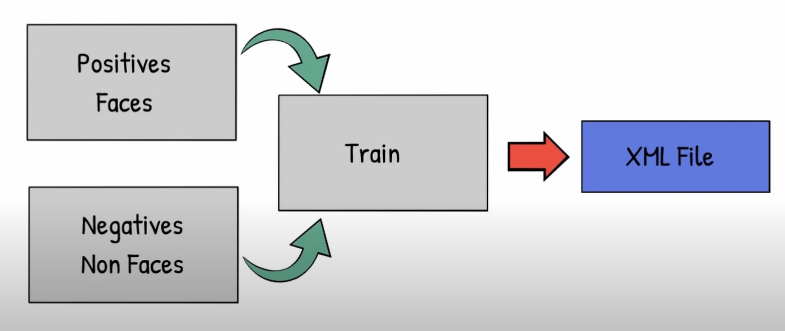

##  [人臉辨識模型]
---

### Introduction for Trained Weights and Models 

 

### Dependencies and Installation
* python=3.6.
* numpy=1.18.5
* matplotlib=3.3.4
* pillow=8.3.1
* pandas=1.3.4

### Predicted results on test set

#### Face sample 1 :

 

#### Face sample 2 :

 

#### Face sample 3 :

 

#### Face sample 4 :

 